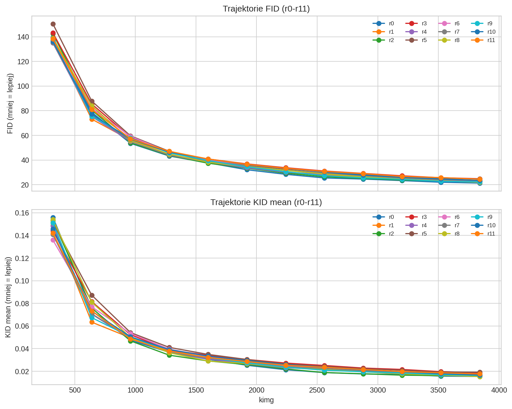
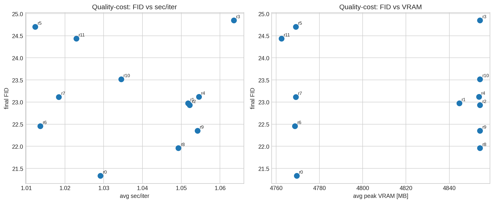
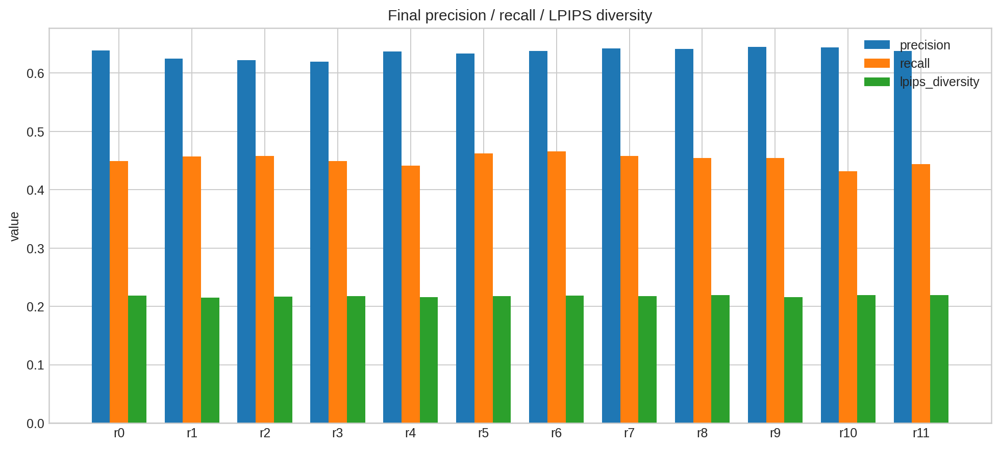
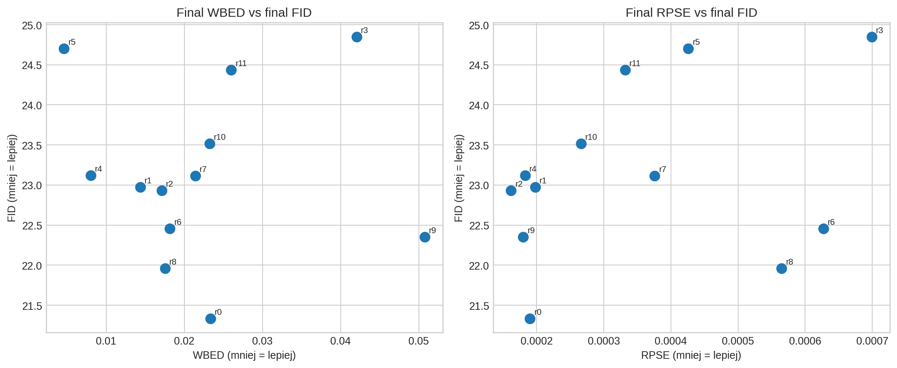
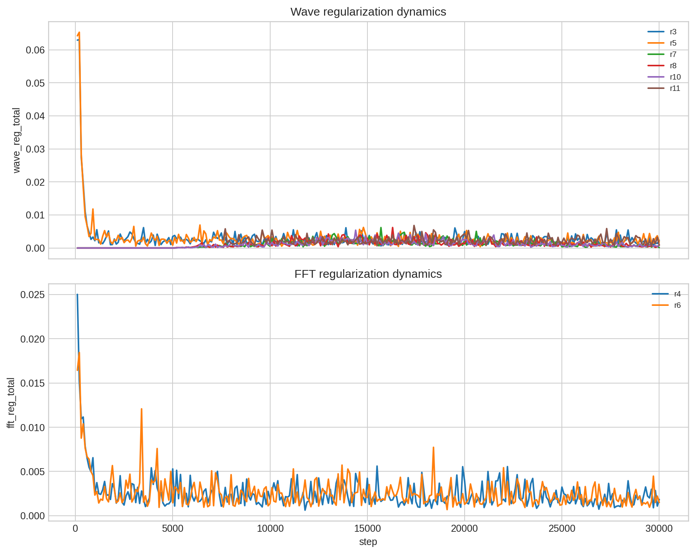

# R3GAN r0-r11: podsumowanie zbiorcze (update po fazie E)

Raport obejmuje runy `r0`-`r11` (CIFAR-10, 32x32, 30k krokow, seed=42 na run).
Nowe runy: `r7`-`r11` testuja harmonogramy `wave_reg`, gate warmup dla galezi waveletowej i bramke FID.

## Najwazniejsze wnioski

- **Najlepszy final FID wciaz ma `r0`: 21.3355**.
- **Najlepszy final KID ma `r8`: 0.015282** (minimalnie lepiej niz `r0`: 0.015421).
- **Najlepszy run z nowych (`r7-r11`) to `r8`**: FID 21.9593 (tylko +0.6238 vs `r0`), wysoki precision/recall i stabilny koszt.
- `r9` daje najlepsze **precision (0.6451)** i bardzo dobry final **RPSE (0.000180)**, ale ma slaby final WBED (0.050744).
- Kombinacja `schedule + gate warmup` (`r10`) nie poprawila FID wzgledem prostszego `r8`.
- Bramka FID (`r11`) nie dala przewagi jakosciowej nad harmonogramem czasowym (`r7`) ani nad `r8/r9`.

## Tabela porownawcza (final, r0-r11)

| run_id | final_fid | final_kid | final_precision | final_recall | final_lpips | final_rpse | final_wbed | fid_auc_vs_kimg | avg_sec_per_iter | avg_vram_peak_mb | delta_fid_vs_r0 |
|---|---:|---:|---:|---:|---:|---:|---:|---:|---:|---:|---:|
| r0 | 21.3355 | 0.015421 | 0.6390 | 0.4492 | 0.2183 | 0.000190 | 0.023329 | 40.9053 | 1.0292 | 4769.4833 | 0.0000 |
| r1 | 22.9752 | 0.017071 | 0.6252 | 0.4568 | 0.2148 | 0.000198 | 0.014362 | 42.0364 | 1.0517 | 4844.6317 | 1.6397 |
| r2 | 22.9342 | 0.016035 | 0.6222 | 0.4575 | 0.2165 | 0.000162 | 0.017102 | 41.8060 | 1.0522 | 4854.1733 | 1.5987 |
| r3 | 24.8504 | 0.018518 | 0.6198 | 0.4494 | 0.2179 | 0.000699 | 0.042055 | 45.3835 | 1.0636 | 4854.1733 | 3.5149 |
| r4 | 23.1217 | 0.016742 | 0.6374 | 0.4415 | 0.2157 | 0.000183 | 0.008025 | 41.8232 | 1.0545 | 4853.7250 | 1.7862 |
| r5 | 24.7034 | 0.019164 | 0.6336 | 0.4626 | 0.2177 | 0.000426 | 0.004612 | 45.6583 | 1.0123 | 4769.0500 | 3.3679 |
| r6 | 22.4578 | 0.016654 | 0.6381 | 0.4655 | 0.2183 | 0.000627 | 0.018143 | 43.7034 | 1.0137 | 4768.7000 | 1.1223 |
| r7 | 23.1124 | 0.016888 | 0.6424 | 0.4578 | 0.2177 | 0.000376 | 0.021406 | 42.6000 | 1.0184 | 4769.0500 | 1.7769 |
| r8 | 21.9593 | 0.015282 | 0.6410 | 0.4542 | 0.2197 | 0.000565 | 0.017518 | 42.9698 | 1.0493 | 4854.1733 | 0.6238 |
| r9 | 22.3503 | 0.016375 | 0.6451 | 0.4543 | 0.2162 | 0.000180 | 0.050744 | 42.1607 | 1.0542 | 4854.1733 | 1.0148 |
| r10 | 23.5177 | 0.016746 | 0.6443 | 0.4314 | 0.2199 | 0.000266 | 0.023220 | 43.6545 | 1.0345 | 4854.1733 | 2.1822 |
| r11 | 24.4362 | 0.017643 | 0.6382 | 0.4439 | 0.2194 | 0.000332 | 0.026008 | 44.5436 | 1.0229 | 4762.4167 | 3.1007 |

## Co realnie poprawilo sie w r7-r11

1. **P0 schedule dla wave_reg zadzialal**:
   - `r7` vs `r5`: FID **24.7034 -> 23.1124** (duza poprawa), przy podobnym koszcie.
   - Wniosek: stale `wave_reg=0.02` rzeczywiscie over-regularizowalo koncowke.

2. **Najmocniejszy upgrade to `r8` (waved + wave_reg schedule)**:
   - `r8` vs `r3`: FID **24.8504 -> 21.9593**, KID **0.018518 -> 0.015282**.
   - To potwierdza, ze problem `r3` byl bardziej w timingu/sile regularyzacji niz w samej idei.

3. **Gate warmup samodzielnie (`r9`) poprawia balans jakosciowy, ale nie metryki pasmowe finalnie**:
   - `r9` ma dobre FID/precision i bardzo niski RPSE, ale final WBED jest wyraznie slaby.

4. **Kombinacja wszystkich mechanizmow (`r10`) nie jest addytywna**:
   - Sredni kompromis, ale bez przewagi nad `r8`; recall dodatkowo spada.

5. **FID-gate (`r11`) nie wygral z prostszym schedule**:
   - Gorszy FID i KID niz `r7`, slaby kandydat na glowny wynik.

## Czy sa wyniki do publikacji?

Krotko: **sa obiecujace, ale jeszcze nie "publication-ready" jako glowny claim**.

Dlaczego:
- Najlepszy final FID nadal ma baseline `r0`.
- `r8` jest bardzo blisko (`+0.62` FID) i ma najlepszy KID, ale to tylko 1 seed.
- Trajektoria (AUC FID vs kimg) dla `r8` jest gorsza od `r0`, czyli uczenie srednio wolniejsze/slabsze w czasie.
- Brak testu istotnosci i rozrzutu miedzy seedami (minimum 3 seedy na kluczowe warianty).

**Werdykt praktyczny:**
- `r8` nadaje sie na **mocny kandydat do sekcji ablation / promising direction**.
- Na glowny claim paperowy potrzeba jeszcze dowodu reprodukowalnosci i mediany po seedach.

## Co odpalac dalej, zeby dowiezc wynik publikacyjny

1. **Priorytet P0: replikacja statystyczna `r0` vs `r8` vs `r6` (po 3 seedy)**
   - Kryterium: medianowy FID(`r8`) <= FID(`r0`) + 0.5 oraz brak regresji recall i KID.
   - To jest najkrotsza droga do twardego claimu.

2. **P0: tail-annealing dla `r8` (dostrojenie koncowki)**
   - Skoro `r8` jest blisko, przetestuj lzejszy ogon regularizacji po 20k (np. szybciej schodzic do 0.003-0.005).
   - Cel: odzyskac ostatnie ~0.4-0.8 FID i przebic `r0`.

3. **P1: stabilizacja WBED w duchu `r9` bez psucia FID**
   - Dla `r9` dodac lagodna kontrole pasm tylko w tailu (np. slaby FFT reg w 20k-30k).
   - Cel: zatrzymac oscylacje WBED przy zachowaniu mocnego precision/RPSE.

4. **P1: checkpoint selection wielokryterialny zamiast "final only"**
   - Wybierac checkpoint z min FID pod constraintami RPSE/WBED (np. <=1.3x minima runu).
   - W kilku runach final jest gorszy niz lepsze punkty po drodze.

5. **P2: szybki sweep dla `r8` (maly koszt, duza szansa zysku)**
   - Zmienic peak `wave_reg_weight`: 0.015 / 0.02 / 0.025 przy tym samym schedule.
   - Zostawic reszte bez zmian, zeby izolowac efekt.

## Rekomendacja do narracji paperowej (na teraz)

- **Quality anchor:** `r0` (najlepszy final FID i najlepsza trajektoria AUC).
- **Best novel candidate:** `r8` (najblizej baseline FID + najlepszy KID).
- **Dodatkowy insight:** `r9` jako dowod, ze gate warmup poprawia precision/RPSE, ale bez kontroli pasm moze popsuc WBED.
- **Negatywny wynik wart pokazania:** `r10/r11` - wiecej mechanizmow nie gwarantuje lepszego FID.

## Zrodla

- `e001-02-r3gan-baseline/summary/r0-r6/report_r0_r6.md`
- `e001-02-r3gan-baseline/artifacts-03-15-01-phase_e_r7_wavereg_sched_32/ANALYSIS.md`
- `e001-02-r3gan-baseline/artifacts-03-16-01-phase_e_r8_waved_wavereg_sched_32/ANALYSIS.md`
- `e001-02-r3gan-baseline/artifacts-03-16-02-phase_e_r9_waved_gatewarm_32/ANALYSIS.md`
- `e001-02-r3gan-baseline/artifacts-03-17-01-phase_e_r10_waved_wavereg_combo_32/ANALYSIS.md`
- `e001-02-r3gan-baseline/artifacts-03-17-02-phase_e_r11_wavereg_fidgate_32/ANALYSIS.md`

## Wykresy

### fid_kid_trajectories.png

### quality_cost_tradeoff.png

### final_pr_lpips.png

### spectral_vs_fid.png

### regularizer_dynamics.png

