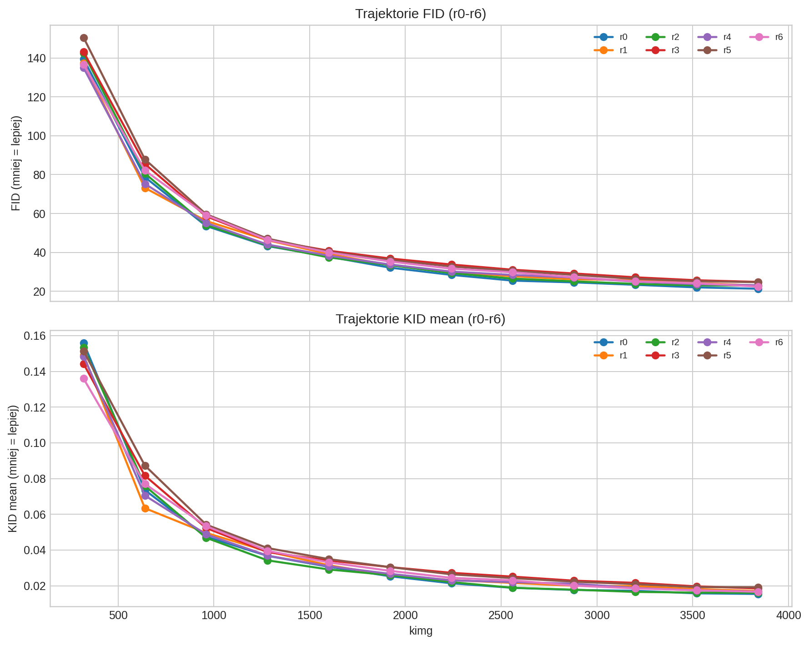
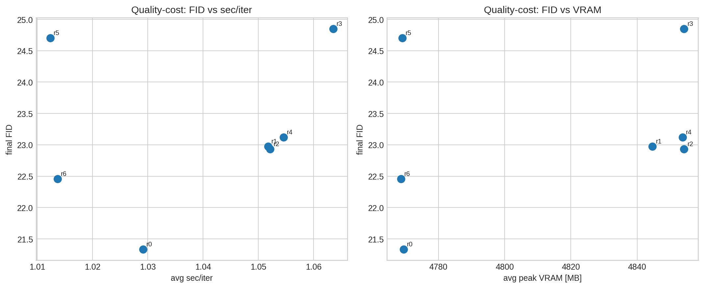
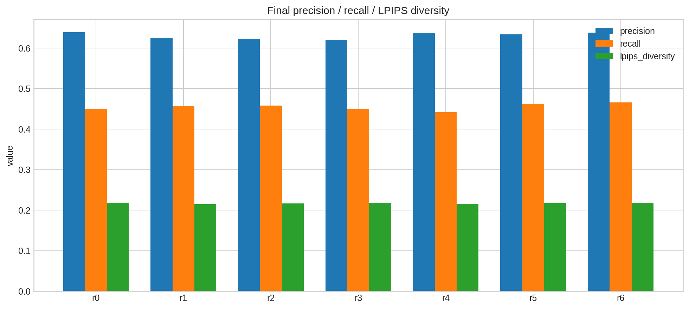
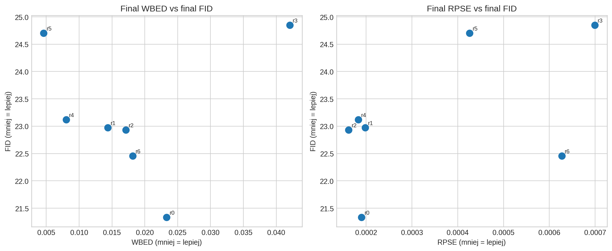
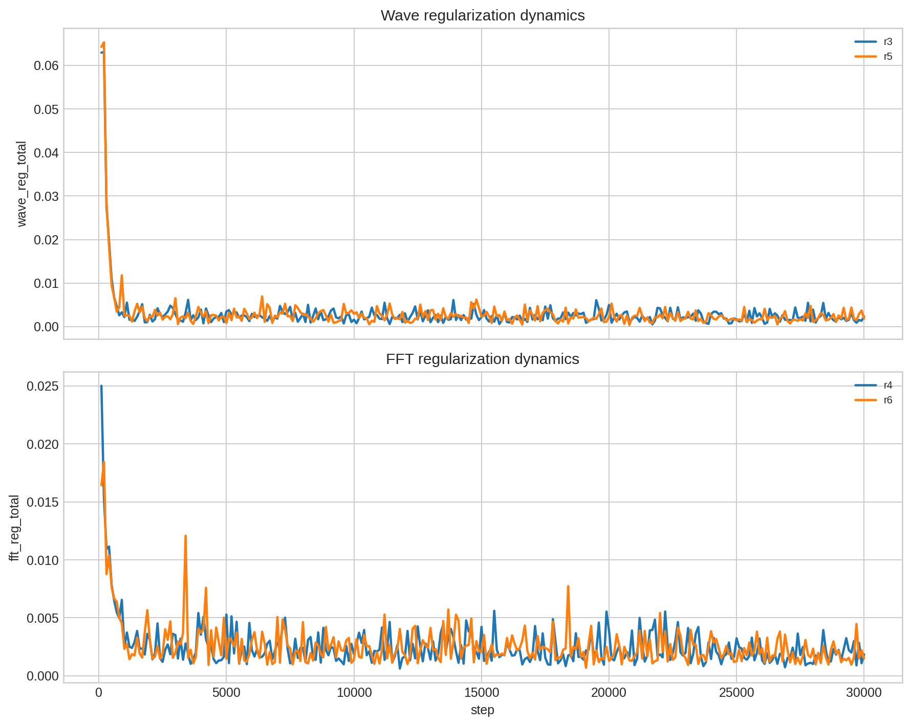

# R3GAN r0-r6: podsumowanie zbiorcze

Raport obejmuje runy `r0`-`r6` z 30k krokami i wspolnym settingiem CIFAR-10 32x32.

## Najwazniejsze wnioski

- Najlepszy koncowy FID ma `r0`: **21.3355**.
- Najlepsza srednia trajektoria (AUC FID vs kimg) ma `r0`: **40.9053**.
- Najwyzszy koncowy recall ma `r6`: **0.4655**.
- Najlepszy koncowy WBED ma `r5`: **0.0046**.
- `wave_reg` (r3, r5) poprawia metryki pasmowe, ale w tej konfiguracji pogarsza FID/KID.
- `fft_reg` bez galezi waveletowej (r6) daje najlepszy kompromis jakosc/czas sposrod wariantow regularizowanych.

## Tabela porownawcza (final)

| run_id | final_fid | final_kid | final_precision | final_recall | final_lpips | final_rpse | final_wbed | fid_auc_vs_kimg | avg_sec_per_iter | avg_vram_peak_mb | delta_fid_vs_r0 |
|---|---|---|---|---|---|---|---|---|---|---|---|
| r0 | 21.3355 | 0.0154 | 0.6390 | 0.4492 | 0.2183 | 0.0002 | 0.0233 | 40.9053 | 1.0292 | 4769.4833 | 0.0000 |
| r1 | 22.9752 | 0.0171 | 0.6252 | 0.4568 | 0.2148 | 0.0002 | 0.0144 | 42.0364 | 1.0517 | 4844.6317 | 1.6397 |
| r2 | 22.9342 | 0.0160 | 0.6222 | 0.4575 | 0.2165 | 0.0002 | 0.0171 | 41.8060 | 1.0522 | 4854.1733 | 1.5987 |
| r3 | 24.8504 | 0.0185 | 0.6198 | 0.4494 | 0.2179 | 0.0007 | 0.0421 | 45.3835 | 1.0636 | 4854.1733 | 3.5149 |
| r4 | 23.1217 | 0.0167 | 0.6374 | 0.4415 | 0.2157 | 0.0002 | 0.0080 | 41.8232 | 1.0545 | 4853.7250 | 1.7862 |
| r5 | 24.7034 | 0.0192 | 0.6336 | 0.4626 | 0.2177 | 0.0004 | 0.0046 | 45.6583 | 1.0123 | 4769.0500 | 3.3679 |
| r6 | 22.4578 | 0.0167 | 0.6381 | 0.4655 | 0.2183 | 0.0006 | 0.0181 | 43.7034 | 1.0137 | 4768.7000 | 1.1223 |

## Co nie wyszlo (i dlaczego to wazne)

- `r3` (wavelet D + wave_reg) i `r5` (wave_reg only) koncza z FID ~24.7-24.9, czyli ~+3.4 do +3.5 pkt vs `r0`.
- W `r3` i `r6` finalne RPSE/WBED sa wyraznie gorsze niz ich minima w trakcie treningu, co wskazuje na rozjazd pod koniec (problem harmonogramu, nie samej idei).
- Sama galaz waveletowa w D (`r2`) nie poprawia FID wzgledem baseline: wynik bliski `r1`, ale dalej slabszy od `r0`.

## Rekomendacja pod publikacje

- **Glowny punkt odniesienia:** utrzymac `r0` jako quality anchor (najlepszy FID/AUC).
- **Glowny kandydat nowosci:** `r6` (FFT reg bez wavelet D) jako wariant kompromisowy: FID blisko r0, najwyzszy recall, praktycznie koszt baseline.
- **Material dodatkowy (ablation):** `r4` i `r5` jako dowod, ze da sie mocno poprawic metryki spektralne, ale kosztem FID lub stabilnosci koncowej.

## Jak realnie podniesc `waved` i `wavereg`, zeby walczyly z baseline

Punkty ponizej sa wysokiej pewnosci, bo wynikaja bezposrednio z logow r2/r3/r5:
- `wavereg` potrafi mocno poprawiac metryki pasmowe (WBED), ale przy stalej wadze 0.02 konczy z gorszym FID.
- Najwiekszy problem jest na koncowce treningu: najlepsze WBED/RPSE pojawia sie wczesniej niz final, a potem czesto jest dryf.

1. **Najwazniejsza zmiana (P0): harmonogram `wave_reg_weight` zamiast stalej wartosci.**
   - Proponowany schedule: `0.00` (0-5k) -> liniowo do `0.02` (5k-15k) -> liniowo do `0.005` (15k-30k).
   - Dlaczego: w r3/r5 kara jest najsilniejsza wtedy, gdy model potrzebuje juz fine-tuningu pod FID; to typowy over-regularization tail.
   - Oczekiwany efekt: zachowac zysk WBED z polowy treningu, a jednoczesnie odzyskac 1-2 pkt FID na koncu.

2. **P0 dla `waved`: delayed activation galezi waveletowej (gate warmup).**
   - Obecnie gate startuje z 0 i model od razu uczy sie wszystkiego naraz; to zwieksza ryzyko konfliktu celow na starcie.
   - Proponowany warmup gate: 0-3k utrzymac blisko 0, potem ramp do ~0.3-0.5 do 12k.
   - Oczekiwany efekt: stabilniejszy poczatek, mniej kary dla FID przy zachowaniu korzysci spektralnych.

3. **P1: `wavereg` wlaczac warunkowo, nie od kroku 0.**
   - Trigger: wlaczenie dopiero po osiagnieciu `FID < 60` albo po 7.5k krokow (co nastapi pozniej).
   - Dlaczego: wczesny etap powinien budowac semantyke/ksztalt, a nie byc silnie domykany przez kryterium czestotliwosciowe.

4. **P1: checkpoint selection pod paper nie z finalu 30k, tylko wielokryterialnie.**
   - Regula praktyczna: wybieraj checkpoint o najnizszym FID przy constraintach `WBED <= 1.3 * min_WBED` i `RPSE <= 1.3 * min_RPSE`.
   - Dlaczego: Twoje logi pokazuja, ze najlepsze punkty spektralne i percepcyjne nie zawsze sa w tym samym kroku.

5. **P2: mala siatka, ktora ma najwieksza szanse przebic r0 bez duzego budzetu.**
   - `r2 + wavereg_schedule` (bez zmian architektury, tylko schedule).
   - `r5 + wavereg_schedule` (najtanszy wariant, juz teraz ma mocny recall i WBED).
   - Dla obu: 3 seedy, ten sam budzet 30k, ta sama ewaluacja co baseline.

Kryterium sukcesu pod publikacje: medianowy FID (3 seedy) <= FID `r0` + 0.5 przy jednoczesnie lepszym WBED lub recall.

## Co odpalac dalej (priorytet)

1. `r6` x 3 seedy (obowiazkowo) + `r0` x 3 seedy dla testu istotnosci roznic FID/recall.
2. `r6` z harmonogramem `fft_reg_weight`: 0.02 do 20k, potem liniowo do 0.005 na 30k (cel: zatrzymac koncowy dryf RPSE/WBED).
3. `r6` weight sweep: 0.01 / 0.02 / 0.03, z tym samym seedem i 30k krokami (ablation pod paper).
4. Krotki run 40k dla `r0` i najlepszego wariantu `r6`, ale z early-stop na minimum WBED/RPSE, nie tylko na koncu 30k.
5. Dla `wave_reg` test annealingu (0.02 -> 0.005 po 15k), bo obecnie sygnal sugeruje over-regularization pod koniec.

## Wykresy

### fid_kid_trajectories.png

### quality_cost_tradeoff.png

### final_pr_lpips.png

### spectral_vs_fid.png

### regularizer_dynamics.png

Nowe konfiguracje fazy E (src/configs/)
Punkt 1 — harmonogram wave_reg_weight (P0)
phase_e_r7_wavereg_sched_32 — baza r5 (wavereg only, bez waved D)
phase_e_r8_waved_wavereg_sched_32 — baza r3 (waved D + wavereg)
Schedule dla obu: 0.0 → 0.02 → 0.005 na krokach 0–5k / 5k–15k / 15k–30k
0–5k: reg wyłączony (model buduje semantykę bez kary)
5k–15k: liniowy ramp do peak 0.02
15k–30k: annealing do 0.005 (zatrzymuje drift na ogonie)
R7 to czystsza ablacja (jeden zmieniany element vs. r5), R8 diagnozuje czy problem r3 był w wadze czy w konflikcie architektur.
 
Punkt 2 — opóźniony gate warmup gałęzi wavelet D (P0)
phase_e_r9_waved_gatewarm_32 — baza r2 (waved D only, bez wavereg)
Gate: 0.0 → 0.4 w oknie kroków 3k–12k
0–3k: gałąź HF w D nieaktywna (gate=0.0) — brak konfliktu z wczesnym treningiem
3k–12k: liniowy ramp do 0.4 (środek zalecanego zakresu 0.3–0.5)
12k+: stały gate=0.4
 
Punkt 1+2 łącznie (kombinowany P0)
phase_e_r10_waved_wavereg_combo_32 — r3 + oba mechanizmy jednocześnie
Gate warmup kończy się przy 12k → wave_reg osiąga szczyt przy 15k → właściwa kolejność dojrzewania. To główny kandydat do publikacji jeśli obie hipotezy się potwierdzą.
 
Punkt 3 — bramka FID-warunkowa dla wave_reg (P1)
phase_e_r11_wavereg_fidgate_32 — baza r5 + wave_reg_fid_gate
Warunek aktywacji: krok ≥ 7500 ORAZ FID ≤ 60.0 (latched). Waga stała 0.02 po aktywacji — celowo bez schedule, żeby izolować efekt samej bramki od timingu. Bezpośrednie porównanie z r7 pokaże czy semantyczna bramka FID jest lepsza niż deterministyczny harmonogram czasowy.